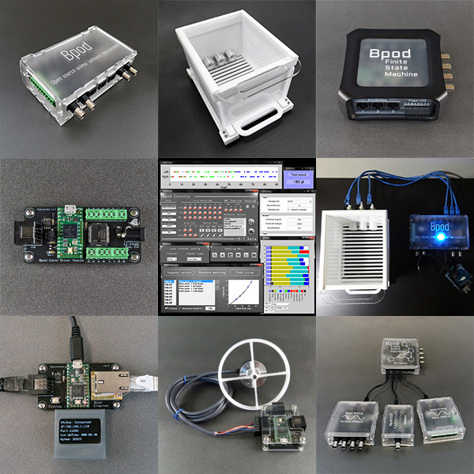

# Bpod MATLAB Software Repository

Bpod is an open source platform for rodent behavior measurement and real-time stimulus control. Bpod is actively developed and maintained by [Sanworks LLC](https://sanworks.io/).

## Wiki

Documentation is provided on the [**Bpod Wiki**](https://sanworks.github.io/Bpod_Wiki/).

## Contents ##

This repository includes:
* MATLAB experiment control software for Bpod
* Example settings and calibration files
* Example protocols
* Example module firmware
* A firmware loading tool

## Setup ##

* Add /Bpod_Gen2/ to the MATLAB path
* Connect a Bpod State Machine to your PC
* Run Bpod() at the MATLAB command prompt
* See the wiki (above) for more info

## Contributions ##
* Please note the guidelines given [here](/CONTRIBUTING.md).

To get started, follow the setup instructions on the Bpod Wiki:
https://sites.google.com/site/bpoddocumentation/installing-bpod

### Edits to run without GUI

#### Starting Bpod

As before, just open MATLAB and run:
```
SerialPort = 'EMU'; % for emulator
ForceJava = 0;
ShowGUI = 0; %0 to not show, 1 to run as normal
Bpod(SerialPort, ForceJava, ShowGUI);
```

Next you can open the liquid calibration GUI or run protocols from the command line:
```
BpodLiquidCalibration('Calibrate');

Protocol = 'MyProtocol';
Subject = 'MySubject';
RunProtocol('Start');
``` 

Running a protocol will block the terminal. To manually stop the protocol, you must use a keyboart interrupt (i.e. press Ctrl-C). This will cause Bpod to run `RunProtocol('Stop')`, just as you would manually stop the program using the GUI. It will also throw some benign errors starting with the line: "Operation terminated by user...".

Lastly, if you would like to use the full Bpod Console GUI, you can toggle the GUI on and off by running:
```
BpodSystem.SwitchGUI();
```
The first time `BpodSystem.SwitchGUI();` is run, the console will be initialized (it will take just a few seconds). Each subsequent call will hide and show the GUI quickly.

TODO: Handle the keyboard interrupt more gracefully. Is this possible in MATLAB?

## Companion Repositories ##
* [Bpod Firmware](https://sanworks.github.io/Bpod_Wiki/install-and-update/firmware-repo-list/)<br>
* [Bpod Hardware & CAD](https://github.com/sanworks/Bpod-CAD)
